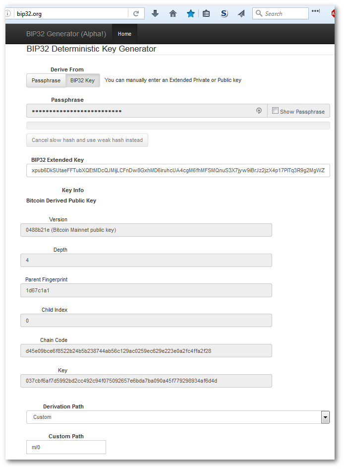
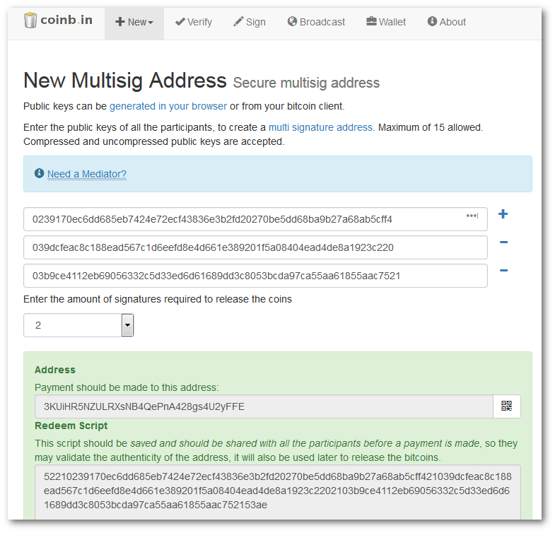
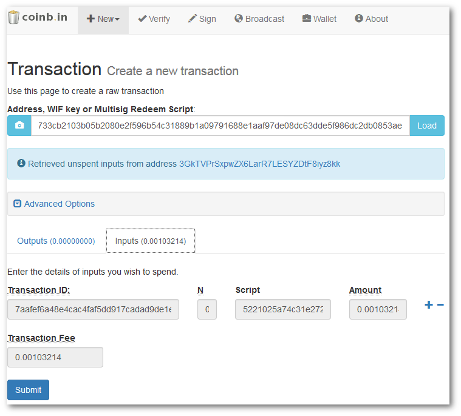
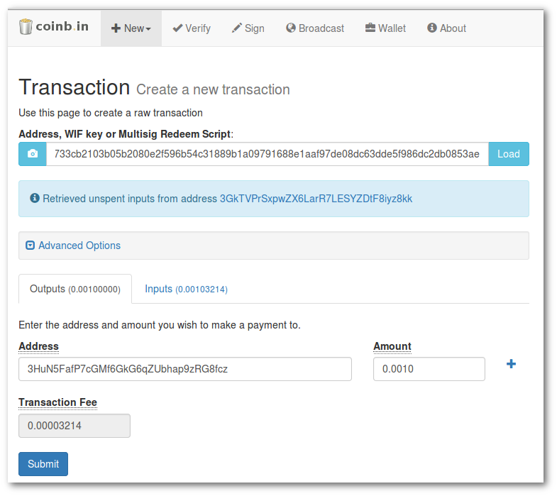
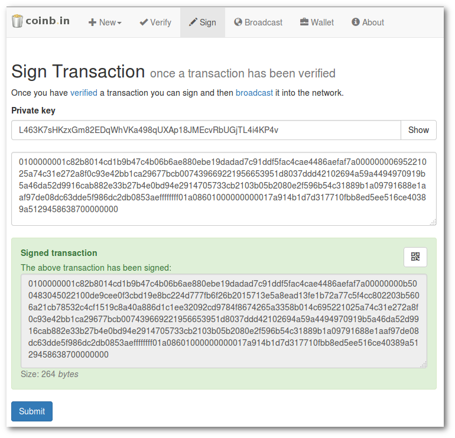
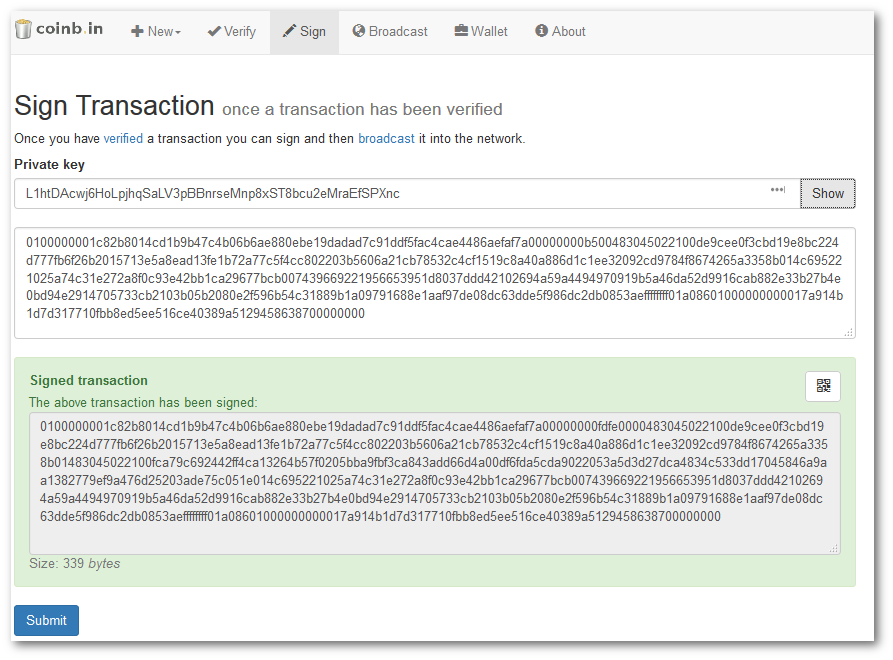
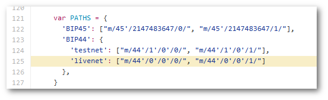

Overview 
=========

After the unfortunate shutdown of Coinkite, I realized that I did not
actually know how to recover the value I had stored in Multisig accounts
(or derive the addresses containing the value) even when in possession
of sufficient information. This document is a result of the frustration
I encountered when trying to remedy that and my attempt to make sure I
can recover value independently of any particular service. If this type
of document exists somewhere, I unfortunately did not find it. Hopefully
it can save someone else the substantial amount of time it took me to
figure this out.

Disclaimer
==========

There are likely some errors, so take everything with a grain of salt.
This document was written to cover my particular situation and focuses
on BitPay’s Copay wallet; however, the tools I used are not BitPay
specific. They are all available on GitHub and will run offline.

Example Setup
=============

I created a 2-of-3 Copay Multisig wallet for testing. Feel free to use
the same wallet to follow the document if you like, but do not transfer
any bitcoin to it (unless you don’t want it).

Backup Mnemonics for 2-of-3 Multisig Copay wallet used for this example:

-   Copayer 0 - **polar beauty wave shock alley weird front unit blanket
    stamp paper token**

-   Copayer 1 - **world modify train layer core grain crash come slush
    spare round uniform**

-   Copayer 2 - **blind pear reveal wood illegal rent trip neither
    unfair ticket bubble lesson**

Important Notes
===============

-   The derivation path used in this document is applicable for Copay
    Version 1.2 and newer. Older versions used a different path. Also,
    hardware wallets use a different root (m/48’ instead of m/44’). See
    the table in the [Additional Notes](#_Additional_Notes) section
    for details.

Mnemonic to BIP32 Extended Key
=================================================================================================================================

1.  Enter mnemonic (recovery words) for the cosigner into the **BIP39
    Mnemonic** field on <https://dcpos.github.io/bip39/>

2.  Under **Derivation Path**, select the **BIP32** tab and set the
    **BIP32 Derivation Path** to ***m/44'/0'/0'/0*** \*

3.  Copy the **BIP32 Extended Key (addresses only)** field \*

4.  Note the **Private Key** column under **Derived Addresses** – this
    is necessary to sign a manually created transaction

BIP32 Key to Public Key
=======================

5.  Open <http://bip32.org/> and change the **Derive From** option to
    ***BIP32 Key***

6.  Enter the BIP32 Extended Key

    a.  The Depth should be 4 (if it is 0, the BIP32 *Root* Key was
        copied in step 3 instead of the BIP32 *Extended* Key)

7.  Change the **Derivation Path** to ***Custom***

8.  Change the **Custom Path** field to ***m/0*** to get the details for
    the first Key (2nd key is m/1, 3rd is m/2, etc.)

    a.  Note that the full path of this key is m/44’/0’/0’/0/0 because
        path m/0 of the BIP32 Extended key m/44’/0’/0’/0 (from Steps 2
        and 3) was used

9.  Copy the **Public Key (Hex)** field and save it for use later when
    creating the multisig address

10.  Go back to Step 1 and repeat for the next cosigner until the Public
    key for all cosigners has been obtained

    a.  The same derivation path must be used for each cosigner key in
        order to generate the multisig address used by the wallet (i.e.
        m/44’/0’/0’/0/0 from all cosigners)

11.  Once public keys are found for all cosigners, continue with step 12.

Public Keys to Multisig Addresses
=================================

1.  The multisig address is based on the Public Keys of each copayer.
    The order of the keys is critical – entering the same keys in a
    different order results in a different multisig address. To get the
    address that corresponds to the one generated by the Copay wallet,
    the Public Keys are sorted from smallest to largest numerically

<!-- -->

a.  For these keys the order is 023…, 039…, 03b… because 023… &lt; 039…
    &lt; 03b… as shown in the adjusted table below

  **Information from Derivation path m/44’/0’/0’/0/0**

  **Copayer** | **Address** | **Public Key (Hex)**
  ------------- | ----------- | ---------------------- 
  0 | 12ebMdYkqzCoQyxPCcpsGsbDazoSXzE5Me | **03b**9ce4112eb69056332c5d33ed6d61689dd3c8053bcda97ca55aa61855aac7521
  1 | 14CyHaVetHyADBpUyrax3wVPkDoJvSvbUj | **023**9170ec6dd685eb7424e72ecf43836e3b2fd20270be5dd68ba9b27a68ab5cff4
  2 | 12u5XXV2YYPbTLbiqwqcidiQmruFyFH2Gx | **039**dcfeac8c188ead567c1d6eefd8e4d661e389201f5a08404ead4de8a1923c220

 
  **Sorted by Public Key (Hex) smallest to largest**

  **Copayer** | **Address** | **Public Key (Hex)**
  ------------- | ----------- | ---------------------- 
  1 | 14CyHaVetHyADBpUyrax3wVPkDoJvSvbUj | **023**9170ec6dd685eb7424e72ecf43836e3b2fd20270be5dd68ba9b27a68ab5cff4
  2 | 12u5XXV2YYPbTLbiqwqcidiQmruFyFH2Gx | **039**dcfeac8c188ead567c1d6eefd8e4d661e389201f5a08404ead4de8a1923c220
  0 | 12ebMdYkqzCoQyxPCcpsGsbDazoSXzE5Me | **03b**9ce4112eb69056332c5d33ed6d61689dd3c8053bcda97ca55aa61855aac7521

1.  Go to <https://coinb.in> and select New -&gt; MultiSig Address (or
    <https://coinb.in/#newMultiSig>)

> 

1.  Enter the Public Keys in the sorted order, select the number of
    signatures required (in this example, it was a 2-of-3 wallet, so the
    amount of signatures required is 2), and Click **Submit**

    a.  Link to the address generated in this example:
        <https://coinb.in/?verify=52210239170ec6dd685eb7424e72ecf43836e3b2fd20270be5dd68ba9b27a68ab5cff421039dcfeac8c188ead567c1d6eefd8e4d661e389201f5a08404ead4de8a1923c2202103b9ce4112eb69056332c5d33ed6d61689dd3c8053bcda97ca55aa61855aac752153ae#verify>

> **Redeem Script (this is necessary to manually create a spend
> transaction):**
>
> 52210239170ec6dd685eb7424e72ecf43836e3b2fd20270be5dd68ba9b27a68ab5cff421039dcfeac8c188ead567c1d6eefd8e4d661e389201f5a08404ead4de8a1923c2202103b9ce4112eb69056332c5d33ed6d61689dd3c8053bcda97ca55aa61855aac752153ae

1.  The returned address is **3KUiHR5NZULRXsNB4QePnA428gs4U2yFFE** which
    matches xpub/0/0 shown in Copay -&gt; Wallet Preferences -&gt;
    Advanced -&gt; Wallet Information

Recovering funds by manually constructing a transaction
=======================================================

This step assumes that the redeem script has already been obtained using
the steps above and the private keys are available (see [Mnemonic to
BIP32 Extended Key](#_Mnemonic_to_BIP32) section regarding obtaining
private keys). For the example, the bitcoin associated with xpub/0/10
will be transferred to a new address.

**Derivation Path:** M/44'/0'/0'/0/10

**Multisig Address:** 3GkTVPrSxpwZX6LarR7LESYZDtF8iyz8kk

**Redeem script ([Coinb.in Verify
Page](https://coinb.in/?verify=5221025a74c31e272a8f0c93e42bb1ca29677bcb007439669221956653951d8037ddd42102694a59a4494970919b5a46da52d9916cab882e33b27b4e0bd94e2914705733cb2103b05b2080e2f596b54c31889b1a09791688e1aaf97de08dc63dde5f986dc2db0853ae#verify)):**

> 5221025a74c31e272a8f0c93e42bb1ca29677bcb007439669221956653951d8037ddd42102694a59a4494970919b5a46da52d9916cab882e33b27b4e0bd94e2914705733cb2103b05b2080e2f596b54c31889b1a09791688e1aaf97de08dc63dde5f986dc2db0853ae

Create the Spend Transaction
----------------------------

1.  On coinb.in, Click **New** -&gt; **Transaction**

2.  Paste the redeem script into the **Address, WIF key or Multisig
    Redeem Script:** field and click **Load**

3.  Once the unspent funds inputs are retrieved, click on the **Inputs**
    tab to see the details

1.  Click the **Outputs** tab, enter the address and amount for each
    destination (can be split and sent to multiple destinations), then
    click **Submit** to generate the unsigned transaction.

    a.  WARNING: make sure the Transaction Fee is a reasonable amount

> 
>
> 
>
> **Unsigned Transaction:**
>
> 0100000001c82b8014cd1b9b47c4b06b6ae880ebe19dadad7c91ddf5fac4cae4486aefaf7a00000000695221025a74c31e272a8f0c93e42bb1ca29677bcb007439669221956653951d8037ddd42102694a59a4494970919b5a46da52d9916cab882e33b27b4e0bd94e2914705733cb2103b05b2080e2f596b54c31889b1a09791688e1aaf97de08dc63dde5f986dc2db0853aeffffffff01a08601000000000017a914b1d7d317710fbb8ed5ee516ce40389a5129458638700000000

Sign the Spend Transaction
--------------------------

1.  Click on the **Sign** menu item

2.  Paste the private key for one of the associated multisig account
    members – Copayer 2 shown here (Note: Private keys are normally
    hidden – the Show button was clicked for this example).

    a.  The key must correspond to the derivation path determined by the
        multisig address – M/44'/0'/0'/0/10 in this case).

3.  Paste the unsigned transaction

4.  Click **Submit** to sign the transaction with the private key

5.  A new signed transaction will be displayed

  **Information from Derivation path m/44’/0’/0’/0/10**

  **Copayer** | **Address** | **Private Key**
  ------------- | ----------- | ---------------------- 
  0 | 1N7bBvso3QXc4VWEi7nLCqFGP8p9yqy56z | L1htDAcwj6HoLpjhqSaLV3pBBnrseMnp8xST8bcu2eMraEfSPXnc
  1 | 1PwM4YaFBsoKhEF7RiqLL8bZQmuRKydrEX | L4EYTAxJ8grT6xKGW9bcghVYWrvBCadSc4boCZicWB4GnGEx8m2H
  2 | 1D3CsVtskAqDAkW2r2tPjm9hFnpQjpKm2x | L463K7sHKzxGm82EDqWhVKa498qUXAp18JMEcvRbUGjTL4i4KP4v

 **New transaction (Original transaction signed with the private key
 from the Copayer 2)**

> 0100000001c82b8014cd1b9b47c4b06b6ae880ebe19dadad7c91ddf5fac4cae4486aefaf7a00000000b500483045022100de9cee0f3cbd19e8bc224d777fb6f26b2015713e5a8ead13fe1b72a77c5f4cc802203b5606a21cb78532c4cf1519c8a40a886d1c1ee32092cd9784f8674265a3358b014c695221025a74c31e272a8f0c93e42bb1ca29677bcb007439669221956653951d8037ddd42102694a59a4494970919b5a46da52d9916cab882e33b27b4e0bd94e2914705733cb2103b05b2080e2f596b54c31889b1a09791688e1aaf97de08dc63dde5f986dc2db0853aeffffffff01a08601000000000017a914b1d7d317710fbb8ed5ee516ce40389a5129458638700000000

1.  If the minimum number of signers has not been met (i.e. 2 out of 3
    for this account), copy the new signed transaction and paste it into
    the script field, then sign the new transaction with the next
    private key

 **New Transaction 2 (First signed transaction signed by Copayer 0)**

> 0100000001c82b8014cd1b9b47c4b06b6ae880ebe19dadad7c91ddf5fac4cae4486aefaf7a00000000fdfe0000483045022100de9cee0f3cbd19e8bc224d777fb6f26b2015713e5a8ead13fe1b72a77c5f4cc802203b5606a21cb78532c4cf1519c8a40a886d1c1ee32092cd9784f8674265a3358b01483045022100fca79c692442ff4ca13264b57f0205bba9fbf3ca843add66d4a00df6fda5cda9022053a5d3d27dca4834c533dd17045846a9aa1382779ef9a476d25203ade75c051e014c695221025a74c31e272a8f0c93e42bb1ca29677bcb007439669221956653951d8037ddd42102694a59a4494970919b5a46da52d9916cab882e33b27b4e0bd94e2914705733cb2103b05b2080e2f596b54c31889b1a09791688e1aaf97de08dc63dde5f986dc2db0853aeffffffff01a08601000000000017a914b1d7d317710fbb8ed5ee516ce40389a5129458638700000000

1.  Repeat step 10 until a sufficient number of keys have signed the
    transaction

Verify the Spend Transaction
----------------------------

1.  Click on **Verify**, paste the signed transaction into the field,
    and click **Submit**

    a.  Check the transaction info (address, amount, etc.)

    b.  Verify that it has been signed by at least the minimum number of
        signers

Broadcast the Spend Transaction
-------------------------------

**WARNING**

***THE NEXT STEP TRANSMITS THE TRANSACTION TO THE BITCOIN NETWORK.
MISTAKES IN THE TRANSACTION WILL BE IRREVOCABLE ONCE THE TRANSACTION IS
BROADCAST.***

***DO NOT DO THIS UNTIL YOU HAVE DOUBLE CHECKED THE DESTINATION
ADDRESSES AND AMOUNTS. ***

***\*\* REMEMBER THAT ANY AMOUNT NOT EXPLICITLY SENT TO A NEW ADDRESS
WILL BE BECOME PART OF THE TRANSACTION FEE (I.E. IT WILL GO TO THE
MINER, NOT TO YOU OR YOUR INTENDED RECIPIENT). \*\****

1.  Read the warning shown above – especially the part regarding
    the fee. Do not send a transaction where all or most of you bitcoin
    is in the fee (for example -
    <https://www.reddit.com/r/Bitcoin/comments/1s9nb8/guy_sent_a_1_btc_fee_by_accident/>)

2.  If you are certain the transaction is correct, Click **Broadcast**,
    paste the transaction, and click **Submit**

    a.  If the transaction is successfully broadcast, the txid will
        be displayed. Otherwise an error will be displayed.

1.  At this point, the transaction should be recognized by the receiving
    wallet and viewable on a block explorer like Blockchain.info,
    block.io, etc. -
    <https://blockchain.info/tx/0391430adfdd11c6d3d121af79c9948699a3b69290056ce7e275bb53977d4619>

Additional Notes
==================================================================================================================

**Step 2**

-   For Copay, *m/44'/0'/0'**/0*** is the derivation path for
    main addresses. Change addresses are derived from
    *m/44'/0'/0'**/1***. This was found (at the time of writing) in the
    source for the Copay Recovery
    (<https://github.com/bitpay/copay-recovery/blob/gh-pages/js/services.js#L125>).

-   Use ***m/44'/1'/0'*** for Testnet. Not sure why Mainnet requires an
    added **/0** on the end

**Step 3** - Note: the BIP32 Extend Key could also be used but using the
public “addresses only” key avoids exposing the private key

**Copay Address Derivation Strategy by Version** (per
<https://github.com/bitpay/copay>)

  **Copay Version**  | **Wallet Type**           |  **Derivation Strategy**|   **Address Type**
  -------------------| ---------------------------| -------------------------| ------------------
  &lt;1.2            | All                       |  BIP45                  |   P2SH
  &gt;=1.2           | Non-multisig              |  BIP44                  |   P2PKH
  &gt;=1.2           | Multisig                  |  BIP44                  |   P2SH
  &gt;=1.5           | Multisig Hardware wallets |  BIP44 (root m/48’)     |   P2SH

References
==========

*BIP 39 Mnemonic Code Converter*

-   GitHub Repository - <https://github.com/dcpos/bip39>

-   Online version - <https://dcpos.github.io/bip39/>

*BIP32 Deterministic Key Generator*

-   GitHub Repository - <https://github.com/bip32/bip32.github.io>

-   Online Version - <http://bip32.org/>

*Coinbin*

-   GitHub Repository - <https://github.com/OutCast3k/coinbin/>

-   Online Versions - <https://coinb.in/> or
    <http://4zpinp6gdkjfplhk.onion/> (Tor only)

*Bitcore Playground* - <https://bitcore.io/playground/>

*Copay Recovery Tool*

-   GitHub Repository - <https://github.com/bitpay/copay-recovery>

-   Online Version - <https://bitpay.github.io/copay-recovery/>

